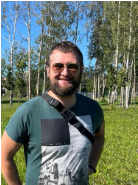

# ***Denis Kuznetsov***



---
## *Frontend-developer*

### Contacts:

| type | link |
| -------- | -------- | 
| email | denispr89@gmail.com |
| telegram | <https://t.me/Need_more_ducks> |
| discord | deniskuznetsov0551 |
| git | [My GitHub](https://github.com/DenisPr-SPb "GIT Link" ) |

### Work practice and studying goal:

I'm already working at the moment. \
I work on maintaining and refactoring old application code.

My goal is to dive much deeper into the knowledge of JavaScript. \
There are gaps in the basics, I want to close them and develop into full stack development.

### Work stack:

- [x] HTML / CSS
- [x] JS
- [x] Node.js
- [x] React

### Projects:

- Psychologist site <https://oganov-sr.ru/>
    + Stack: React, styled-components, TypeScript, Vite, Nginx, OS Ubuntu.
- Simple landing <https://denispr-spb.github.io/simple-landing01/>
    + Stack: HTML, CSS, Git.

### First code was:

```html
<!DOCTYPE HTML>
<html>
<head>
  Page Title
</head>

<body>
    <script>
      document.write("<h1>Макс, все заработало!:)</h1>")
    </script>
</body>
</html>
```

### Information:

+ Education:
    - HTML/CSS (School "Brunoyam")
    - JS (School "learn.javascript.ru")
    - Bachelor of Economic Sciences (That's what it says on my diploma)
+ Languages:
    - Russian (Native)
    - English (B1)
    - Romanian (A1)
+ Duolingo's user with shock mode for than **200** days!

### A few human words about me:

I love traveling with my family by car and joint family trips with friends. \
I go in for sports, a fan of running and Muay Thai. Every morning exercise and meditation. \
I like to read and listen to books, classics, science-pop, novels... \
My top: Harry Potter, The Master and Margarita, Dovlatov's stories, The Razor's Edge, The Seagull Jonathan Livingston. \
I study and learn new things. \
I love fixing something that is broken, be it a children's toy or something technical. \

***